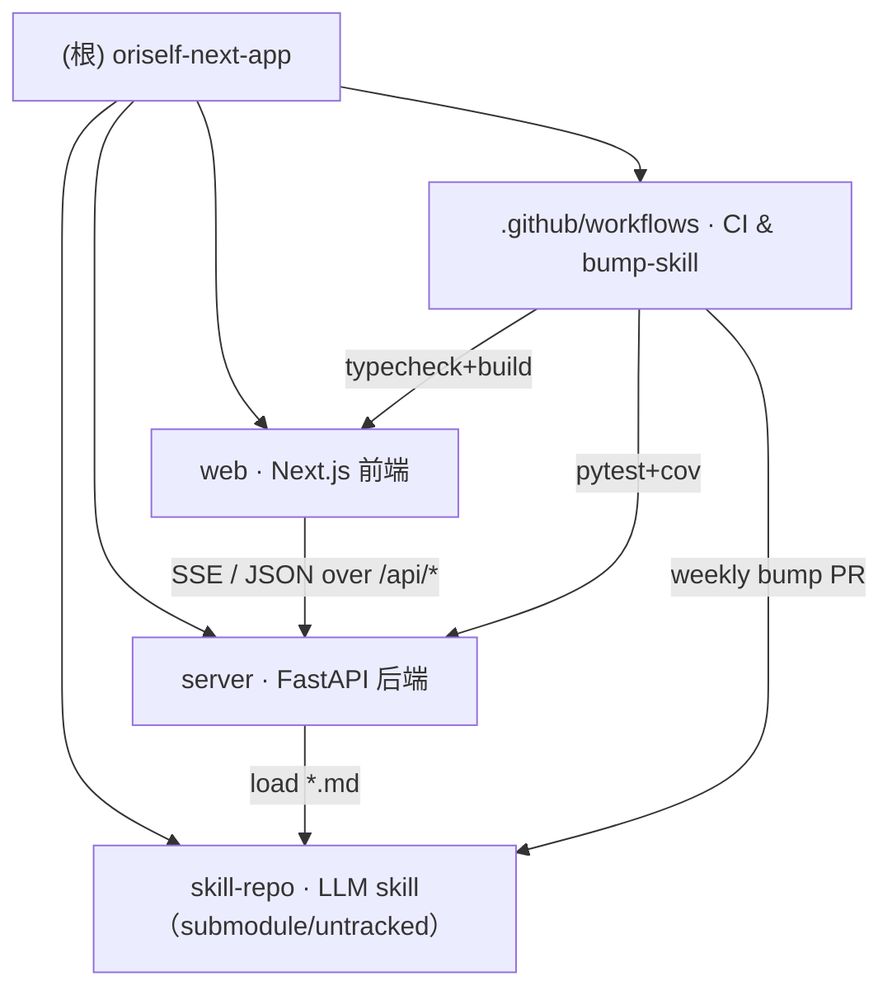

<!-- BEGIN ZCF:AUTO-GENERATED (root) -->
# OriSelf Next · 仓库架构总览

> 本文件由 `/zcf:init-project` 于 **2026-04-18 22:30:17** 生成（自动区间位于 `BEGIN/END ZCF:AUTO-GENERATED` 注释之间；此区间外的手写内容会在下次运行时保留）。

## 一、项目摘要（推断）

OriSelf Next 是一个以「写信」隐喻驱动的对话式 MBTI 人格画像 Web 应用。用户在 Next.js 前端（`web/`）里打开一封"信"，和后端（`server/`，FastAPI）暴露的 SSE 流式对话接口 `POST /letters/{id}/turn` 逐轮交流；对话满足最低轮数（`MIN_CONVERGE_ROUND = 6`，硬上限 `MAX_ROUNDS = 30`）后，后端独立调用 LLM 跑一次 `CONVERGE.md`，生成自包含 HTML 报告（"Issue"），通过 `GET /api/issues/{slug}/render` 以沙箱 `<iframe>` 形式嵌入前端。LLM 的风格 / 流程 / 品味约束全部写在 `skill-repo/skills/oriself/`（作为 Git submodule 或 untracked 子目录接入）下的 Markdown 文件里（SKILL.md / ETHOS.md / CONVERGE.md / `phases/*` / `techniques/*` / `domains/*` / `examples/*`），因此项目自称"产品即 skill"。支持的 LLM provider 通过 `ORISELF_PROVIDER` 环境变量切换，包含 Qwen / DeepSeek / Kimi / OpenAI / 302.ai Gemini 兼容端（统一走 OpenAI compatible 接口）以及用于离线 / 测试的 `mock`。前端附带首页最近信件本地存档（纯 localStorage）、反馈抽屉、重写（rewrite）上一轮等能力；后端另有 `/feedback`、`/issues/{slug}/publish` 等运维接口。

关键形态关键词：Next.js 15 App Router + React 19 + Tailwind · FastAPI + SQLAlchemy 2.x + SQLite · SSE 流式 token · LLM provider 可切 · skill-as-markdown 作为 submodule。

> [需确认] 项目的对外品牌域 `next.oriself.com` 和两条 GitHub 仓库链接（`oriself-next` skill 仓库、`oriself-next-app` app 仓库）见 `web/app/page.tsx` 页脚；如果你希望 README 里对外表述与此不一致，可在 `项目摘要` 下手写补充，该段会保留。

## 二、架构总览

```
┌──────────────────────── Browser ────────────────────────┐
│  Next.js App Router (web/)                              │
│   · /             Landing (最近信件本地缓存)            │
│   · /letters/new  Server Component → POST /letters      │
│   · /letters/:id  SSE 对话视图 (Composer / Turn)        │
│   · /issues/:slug 报告壳 + <iframe sandbox>             │
└──────────────┬──────────────────────────────────────────┘
               │  同域 /api/* → next.config.mjs rewrites
               ▼
┌──────────────────────── FastAPI (server/) ──────────────┐
│  routes/letters.py    POST/GET 对话 · SSE               │
│  routes/issues.py     报告元数据 / 渲染 / 公开开关       │
│  routes/feedback.py   匿名反馈 + per-IP 速率            │
│  skill_runner.py      TurnRunner / ReportRunner         │
│  skill_loader.py      读取 skill-repo 下的 Markdown     │
│  guardrails.py        STATUS 解析 + HTML 安全 + MBTI 一致│
│  llm_client.py        openai-compatible / mock          │
│  models.py            SQLAlchemy ORM（sessions / convs） │
└──────────────┬──────────────────────────────────────────┘
               │ httpx → provider（Qwen / DeepSeek / Kimi / OpenAI / 302.ai）
               ▼                                 │
     ┌──────────────────┐                        │
     │ LLM provider     │                        │
     └──────────────────┘                        │
                                                 │
     ┌──────────────────┐   load on startup      │
     │ skill-repo/*.md  │◄───────────────────────┘
     └──────────────────┘
```

### 2.1 模块结构图（Mermaid）



## 三、模块索引

| 路径 | 职责 | 语言 / 栈 | 入口 | 模块文档 |
|---|---|---|---|---|
| `web/` | 用户侧 Web 端：登录自己、写信、看报告；SSE 消费、iframe 渲染 | TypeScript · Next.js 15 · React 19 · Tailwind | `web/app/layout.tsx` · `web/app/page.tsx` | [web/CLAUDE.md](./web/CLAUDE.md) |
| `server/` | 对话循环、skill prompt 组装、多 provider LLM 适配、SQLite 持久化、报告渲染 | Python 3.10+ · FastAPI · SQLAlchemy 2 · httpx | `server/oriself_server/main.py` (`uvicorn oriself_server.main:app`) | [server/CLAUDE.md](./server/CLAUDE.md) |
| `skill-repo/` | LLM 的"剧本"：SKILL.md / ETHOS.md / CONVERGE.md / phases / techniques / domains / examples | Markdown | `skill-repo/skills/oriself/SKILL.md` | *(外部仓库；本仓不生成模块 CLAUDE.md，避免覆盖上游)* |
| `.github/workflows/` | CI（web typecheck+build / server pytest+cov）与 `bump-skill.yml`（每周一 UTC 09:00 拉最新 skill submodule 开 PR） | YAML | `ci.yml` · `bump-skill.yml` | *(单文件，无独立 CLAUDE.md)* |

## 四、运行与开发

### 4.1 前端（`web/`）

```bash
cd web
pnpm install                                   # packageManager pnpm@9.15.0
cp .env.local.example .env.local               # NEXT_PUBLIC_API_URL / API_INTERNAL_URL
pnpm dev                                       # :3000，next.config.mjs 把 /api/* rewrite 到后端
pnpm typecheck                                 # tsc --noEmit
pnpm build && pnpm start                       # 本地生产模式
```

Docker：`BUILD_STANDALONE=1 pnpm build` 产出 `.next/standalone`，`web/Dockerfile` 多阶段构建，最终 `node server.js` 监听 3000。

### 4.2 后端（`server/`）

```bash
cd server
pip install -e ".[dev]"                        # 可选 [postgres] 切 psycopg
ORISELF_PROVIDER=mock \
  uvicorn oriself_server.main:app --reload     # :8000，零 API key
# Swagger: http://localhost:8000/docs
python -m oriself_server.cli --provider mock   # 终端里直接跑一封信
```

环境变量（详见 `server/oriself_server/main.py` 顶部 docstring）：

- `ORISELF_PROVIDER` — `qwen` / `deepseek` / `kimi` / `openai` / `mock`（默认由请求体决定，否则读此变量再兜 `"mock"`）
- `ORISELF_DB_PATH` — SQLite 路径，默认 `oriself_v2.db`
- `ORISELF_{PROVIDER}_API_KEY` — 各 provider 密钥；支持 `GEMINI_*` 别名（见最近提交 `3fa0ac9`）
- `ORISELF_CORS_ORIGINS` — 逗号分隔的允许 origin，留空时默认 `*`
- `ORISELF_SKILL_ROOT` — 指向 `skill-repo/skills/oriself` 的绝对路径；未设时按相对结构推断

后端会自动 `load_dotenv` 项目根或 `server/` 下的 `.env`（`main.py` 做了 two-candidate 查找）。

### 4.3 LLM skill（`skill-repo/`）

- 本仓以 Git submodule 形式引用；当前 working tree 里作为 untracked 目录存在（见 `git status`）。
- CI 的 `bump-skill.yml` 每周一自动 `git fetch origin main` + 开 PR，标题包含从 `SKILL.md` 抓出的版本号。
- 本地如要改 prompt：`cd skill-repo && git checkout main && 改完 push`，回到主仓 `git add skill-repo && git commit`。

## 五、测试策略

| 层 | 工具 | 命令 | 说明 |
|---|---|---|---|
| 后端单测 / smoke | pytest + pytest-asyncio + pytest-cov | `cd server && pytest --cov=oriself_server` | `server/tests/test_v24_smoke.py` 覆盖 STATUS parse / guardrails / Mock backend；`test_skill_loader.py` 验证 skill bundle 加载 |
| 前端类型 | `tsc --noEmit` | `cd web && pnpm typecheck` | 无单测框架；CI 只跑 typecheck + `pnpm build` |
| CI | GitHub Actions | `.github/workflows/ci.yml` | Python 3.12 + Node 20 双 job |

主要缺口：web 端目前没有 e2e / 组件测试；server 无集成层（真 provider）测试。详见下方「推荐的下一步深挖路径」。

## 六、编码规范

- **TypeScript（web）**：`strict: true`，路径别名 `@/*` → `./*`；ESLint 走 `eslint-config-next`；禁默认调色盘（Tailwind `theme.colors` 完全自定义，见 `tailwind.config.ts`）。
- **Python（server）**：`from __future__ import annotations` 全面启用；v2.4 哲学是"软约束写 skill，硬约束写 guardrails"——只有 4 条硬拦截（轮数上限 / mbti 正则 / report_html XSS / 4 字母一致性），其余品味问题交给 skill prompt 与用户手动「重写这轮」。
- **数据库迁移**：无 Alembic。`init_db()` 内置一次性 `DROP INDEX IF EXISTS uq_session_round_discarded`（v2.4.x 修复重写冲突）。新增字段请在本文件下方「变更记录」里登记，并考虑是否同样需要 in-place 小迁移。
- **安全**：LLM 生成的 HTML 只能通过 `/issues/{slug}/render` 的 CSP sandbox 头 + 前端 `iframe sandbox="allow-scripts"`（禁 `allow-same-origin`）双层隔离；任何新增用户可见文本走 `utils/html_sanitize.escape_user_quote`。

## 七、AI 使用指引（提示 Claude Code 时）

- 动 `server/oriself_server/routes/letters.py` 的 SSE 事件格式时，**同时**改 `web/lib/api.ts::streamToDone` 的 frame 解析；协议字段定义在 `web/lib/types.ts::TurnDonePayload`。
- 动 `schemas.ConvergeOutput` 字段时，检查 `guardrails.verify_report_html_consistency`、`routes/letters.compose_result` 的序列化分支、以及 `web/lib/types.ts::LetterResult`。
- 新增 provider 时只改 `server/oriself_server/llm_client.py` 的 `make_backend`；所有 provider 都走 `openai_compatible` 类，只差 base_url + key 前缀。
- 涉及 skill 文本的改动属于 `skill-repo` 仓，不要直接改 `server/` 的 Python 文件绕过 skill。
- 不要在对话轮里引入 JSON schema retry：v2.4 的 design note 明确说"对话轮不 retry，用户点「重写」"。
- 生成新的模块 CLAUDE.md 时，面包屑路径请按目录层级正确设置（根 → web 只需两跳）。

## 八、覆盖率快照（本次运行）

| 维度 | 数值 |
|---|---|
| 手动扫描文件数 | 23（排除 `node_modules` / `skill-repo/` 子目录内文件） |
| 识别出的根级模块 | 2 个写入 CLAUDE.md（`web/`、`server/`） + 1 个仅索引（`skill-repo/` 外部仓） |
| 主要被忽略目录 | `web/node_modules/**`（pnpm store，千量级文件）、`.git/**`、`server/tests/__pycache__/**`、`.next/**`、`dist/**` |
| 未读内容（按缺口登记） | `skill-repo/skills/oriself/*.md` 全文内容、`web/components/**` 交互细节、`server/oriself_server/utils/*.py` 清洗实现、`server/oriself_server/skill_runner.py` 下半部（phase 选择逻辑）、`server/oriself_server/llm_client.py` 下半部（openai-compatible 实现） |

## 九、推荐的下一步深挖路径

1. `web/components/letter/composer.tsx` + `turn.tsx` — 对话主界面交互；会揭示 z-index / 光标、以及 `lift composer z-index above main` 修复（commit `5ec07b8`）的具体结构。
2. `server/oriself_server/skill_runner.py`（第 80 行以后）— `choose_phase_key`、`advance_state`、`ReportRunner.compose` 的 3-retry 策略。
3. `server/oriself_server/llm_client.py`（第 60 行以后）— `openai_compatible` 实现、SSE 解析、mock 的 status / converge 回放。
4. `server/oriself_server/utils/html_sanitize.py` + `prompt_sanitize.py` — 把 XSS / prompt injection 边界补到文档里。
5. `skill-repo/skills/oriself/SKILL.md` / `CONVERGE.md` — 不在本仓扫描，但理解"产品即 skill"必读。
6. `web/components/issue/issue-chrome.tsx` + `feedback/feedback-sheet.tsx` — issue 页壳与反馈抽屉。
7. 补一份 `server/tests` 对 `routes/letters.py` 的 endpoint-level 集成测（当前只有 unit smoke）。

## 十、变更记录 (Changelog)

| 时间 | 内容 | 来源 |
|---|---|---|
| 2026-04-18 22:30:17 | 初始化根级 CLAUDE.md；创建 `web/CLAUDE.md`、`server/CLAUDE.md`；写入 `.claude/index.json` | `/zcf:init-project` 自适应扫描 |
| *(保留给手写记录；本行以下内容在重新运行时不会被覆盖)* | | |

<!-- END ZCF:AUTO-GENERATED (root) -->
